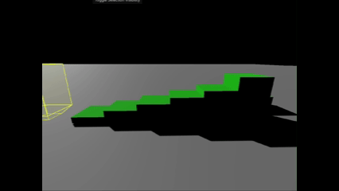

# Prism Collider 3D

A Godot 4 editor plugin that generates a convex prism collider with configurable top and bottom points.  
Designed to help characters smoothly traverse stairs, ledges, and small obstacles.

---

## Features

- Supports circular or square prism bodies for flexible level geometry
- Optional top and bottom points for stepped or tapered shapes
- Adjustable total height and body size
- Circular prisms support configurable radial segments for smoother shapes
- Organized property groups in the editor for easy tuning
- Optimized for characters to walk up stairs and small obstacles
- Developed after experimenting with sweep-forward and floating character controller methods; this convex prism shape proved to be the most reliable solution

---

## Installation

1. Download or clone this repository
2. Copy the `addons/prism_collider_3d` folder into your Godot project
3. Enable the plugin in **Project Settings → Plugins**
4. Access the plugin’s functionality via the editor tools

---

## Usage

- Select your node(s) in the scene tree
- Use the plugin to generate prism colliders based on the selected geometry
- Adjust parameters in the inspector, including optional top and bottom points

> Works best with stepped or blocky geometry and simplifies collision setup for stairs and ledges.

---

## Demo

  
*Sliding up stairs example.*

---

## Godot Version

- Godot 4.x (tested with 4.6)

---

## License

MIT License – see [LICENSE](addons/prism_collider_3d/LICENSE) for details.

---

## Acknowledgements

This plugin was inspired by a Reddit user, Sloomp, and their discussion on character movement over stepped geometry:  
[Reddit discussion link](https://www.reddit.com/r/godot/comments/1luz1z4/simple_characterbody3d_stair_stepping/)

The original idea informed the design, but this plugin extends it with full prism support (circular or square cross-section) and configurable top and bottom points.

